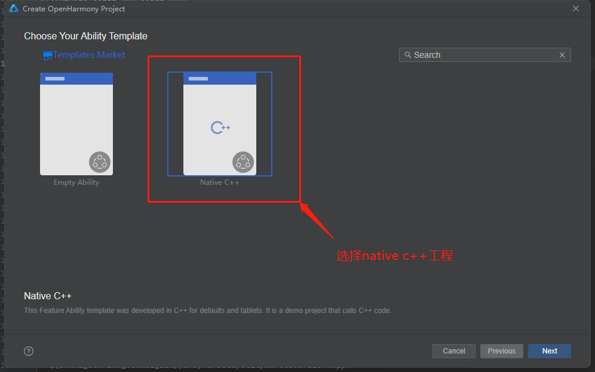

# 三方库加入IDE(DevEco Studio)工程

### 概述

本文介绍如何将三方库加入IDE（DevEco studio）工程中进行编译

### 环境准备

- DevEco studio[下载地址](https://developer.harmonyos.com/cn/develop/deveco-studio/)

### 开发步骤

这里以helloworld工程引入三方库为例

##### 新建工程

新建一个native c++工程

&nbsp;

##### 加入工程编译

将三方库加入工程中编译，有如下步骤：

- 将三方库加入到工程目录下

- 在工程根目录下的CMakeLists.txt中，使用add_subdirectory命令调用子目录中的CMakeLists.txt来进行编译

- 引入三方库头文件，使用include_directories命令指定工程所使用的三方库的头文件的目录

- 链接三方库的动态库，注意，生成的三方库动态库名称可以在三方库构建脚本中查到

