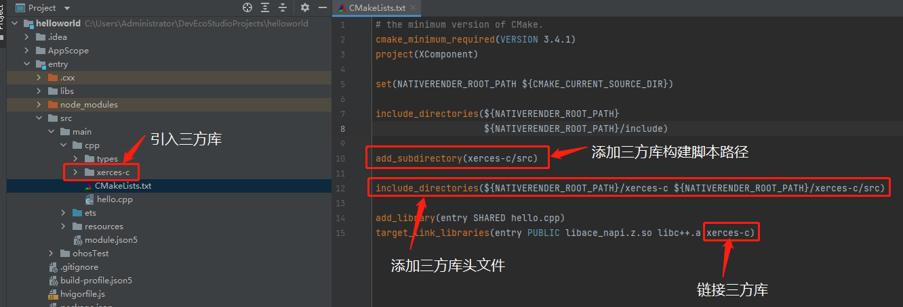

# 三方库引入IDE(DevEco Studio)工程

这里以helloworld工程引入三方库为例,如下图：

如上图所示：

1.将三方库加入到工程目录下；

2.在工程根目录下的CMakeLists.txt中，使用add_subdirectory命令调用子目录中的CMakeLists.txt来进行编译；

3.引入三方库头文件，使用include_directories命令指定工程所使用的三方库的头文件的目录；

4.链接三方库的动态库，注意，生成的三方库动态库名称可以在三方库构建脚本中查到。