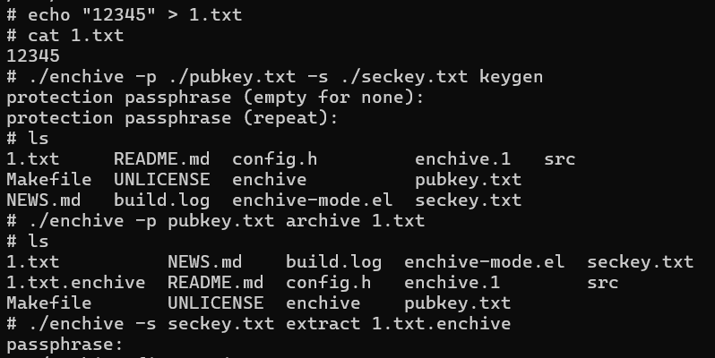

# enchive 集成到应用hap

本库是在RK3568开发板上基于OpenHarmony3.2 Release版本的镜像验证的，如果是从未使用过RK3568，可以先查看[润和RK3568开发板标准系统快速上手](https://gitee.com/openharmony-sig/knowledge_demo_temp/tree/master/docs/rk3568_helloworld)。

## 开发环境

- [开发环境准备](../../../docs/hap_integrate_environment.md)

## 编译三方库

- 下载本仓库

  ```shell
  git clone https://gitee.com/openharmony-sig/tpc_c_cplusplus.git --depth=1
  ```

- 三方库目录结构

  ```shell
  tpc_c_cplusplus/thirdparty/enchive-3.5   #三方库enchive-3.5的目录结构如下
  ├── docs                              #三方库相关文档的文件夹
  ├── HPKBUILD                          #构建脚本
  ├── HPKCHECK                          #测试脚本
  ├── SHA512SUM                         #三方库校验文件
  ├── README.OpenSource                 #说明三方库源码的下载地址，版本，license等信息
  ├── README_zh.md                      #三方库简介
  ```

- 在lycium目录下编译三方库

  编译环境的搭建参考[准备三方库构建环境](../../../lycium/README.md#1编译环境准备)

  ```shell
  cd lycium
  ./build.sh enchive-3.5
  ```

- 三方库头文件及生成的库

  在lycium目录下会生成usr目录，该目录下存在已编译完成的32位和64位三方库

  ```shell
  enchive-3.5/arm64-v8a   enchive-3.5/armeabi-v7a
  ```

- [测试三方库](#测试三方库)

## 应用中使用三方库

- 在IDE的cpp目录下新增thirdparty目录，将编译生成的头文件拷贝到该目录下，将编译生成的三方库以及依赖库全部（动态库名字带版本号和不带版本号的都需要）拷贝到工程的libs目录下。该库未生成头文件及静态/共享库。如下图所示：
  &nbsp;

  &nbsp;


## 测试三方库
- 编译出可执行的文件，使用原库自带的测试用例来做测试。但本库没有测试用例，改为执行demo验证其功能 [准备三方库测试环境](../../../lycium/README.md#3ci环境准备)
- 进入到构建目录下的example目录，运行demo（注意arm64-v8a为构建64位的目录，armeabi-v7a为构建32位的目录）。
 1.新建名为1.txt文本文件，输入内容：12345。
 2.执行：./enchive -p ./pubkey.txt -s ./seckey.txt keygen 生成一个密钥对，将公钥存储到当前目录下的pubkey.txt，私钥存储到seckey.txt文件，需要输入密码并二次验证，供解密时确认。
 3.执行：./enchive -p pubkey.txt archive 1.txt 使用公钥加密 1.txt 文件，生成名为1.txt.enchive加密文件。此时无法查看1.txt.enchive内容
 4.执行：./enchive -s seckey.txt extract 1.txt.enchive 使用私钥解密1.txt.enchive文件，此时需输入生成密钥对时设置的密码。
 执行结果如图所示：

```shell
  cd /data/tpc_c_cplusplus/thirdparty/enchive-3.5/enchive-3.5/arm64-v8a-build
  touch 1.txt
  echo "12345" > 1.txt
  ./enchive -p ./pubkey.txt -s ./seckey.txt keygen
  ./enchive -p pubkey.txt archive 1.txt
  ./enchive -s seckey.txt extract 1.txt.enchive
```
&nbsp;

## 参考资料

- [润和RK3568开发板标准系统快速上手](https://gitee.com/openharmony-sig/knowledge_demo_temp/tree/master/docs/rk3568_helloworld)
- [OpenHarmony三方库地址](https://gitee.com/openharmony-tpc)
- [OpenHarmony知识体系](https://gitee.com/openharmony-sig/knowledge)