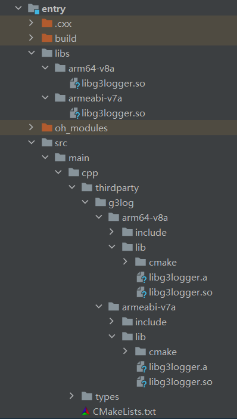
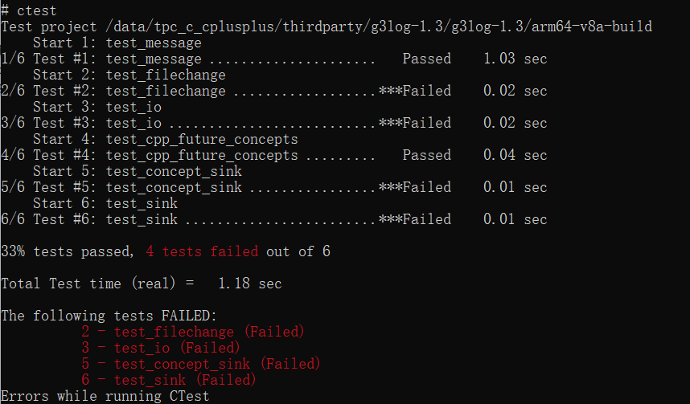

# g3log 集成到应用hap

本库是在RK3568开发板上基于OpenHarmony3.2 Release版本的镜像验证的，如果是从未使用过RK3568，可以先查看[润和RK3568开发板标准系统快速上手](https://gitee.com/openharmony-sig/knowledge_demo_temp/tree/master/docs/rk3568_helloworld)。

## 开发环境

- [开发环境准备](../../../docs/hap_integrate_environment.md)

## 编译三方库

- 下载本仓库

  ```shell
  git clone https://gitee.com/openharmony-sig/tpc_c_cplusplus.git --depth=1
  ```

- 三方库目录结构

  ```shell
  tpc_c_cplusplus/thirdparty/g3log-1.3   #三方库g3log的目录结构如下
  ├── docs                              #三方库相关文档的文件夹
  ├── HPKBUILD                          #构建脚本
  ├── HPKCHECK                          #测试脚本
  ├── SHA512SUM                         #三方库校验文件
  ├── README.OpenSource                 #说明三方库源码的下载地址，版本，license等信息
  ├── README_zh.md                      #三方库简介
  ├── g3log-1.3_oh_pkg.patch            #用于g3log库编译的补丁
  ```

- 在lycium目录下编译三方库

  编译环境的搭建参考[准备三方库构建环境](../../../lycium/README.md#1编译环境准备)

  ```shell
  cd lycium
  ./build.sh g3log
  ```

- 三方库头文件及生成的库

  在lycium目录下会生成usr目录，该目录下存在已编译完成的32位和64位三方库

  ```shell
  g3log/arm64-v8a   g3log/armeabi-v7a
  ```

- [测试三方库](#测试三方库)

## 应用中使用三方库

- 在IDE的cpp目录下新增thirdparty目录，将编译生成的头文件和库文件拷贝到该目录下，将编译生成的三方库（动态库名字带版本号和不带版本号的都需要）拷贝到工程的libs目录下，如下图所示：
  &nbsp;

  &nbsp;

- 在最外层（cpp目录下）CMakeLists.txt中添加如下语句

  ```shell
  #将三方库加入工程中
  target_link_libraries(entry PRIVATE ${CMAKE_CURRENT_SOURCE_DIR}/thirdparty/g3log/${OHOS_ARCH}/lib/libg3logger.so)
  #将三方库的头文件加入工程中
  target_include_directories(entry PRIVATE ${CMAKE_CURRENT_SOURCE_DIR}/thirdparty/g3log/${OHOS_ARCH}/include)
  ```

## 测试三方库
- 编译出可执行的文件，使用原库自带的测试用例来做测试 [准备三方库测试环境](../../../lycium/README.md#3ci环境准备)
- 进入到构建目录运行测试用例（注意arm64-v8a为构建64位的目录，armeabi-v7a为构建32位的目录）。
批量测试时，有4个测试用例因找不到符号“backtrace”和“backtrace_symbols”而失败。尝试将libexecinfo.so、libunwind.so.8.0.1等可以与backtrace功能兼容的轻量级库部署到开发板并设置环境变量，仍无法解决问题。可能是由于平台本身不支持或限制了完整的堆栈回溯功能。
 执行结果如图所示：

```shell
  cd /data/tpc_c_cplusplus/thirdparty/g3log-1.3/g3log-1.3/arm64-v8a-build
  ./ctest
```
&nbsp;

## 参考资料

- [润和RK3568开发板标准系统快速上手](https://gitee.com/openharmony-sig/knowledge_demo_temp/tree/master/docs/rk3568_helloworld)
- [OpenHarmony三方库地址](https://gitee.com/openharmony-tpc)
- [OpenHarmony知识体系](https://gitee.com/openharmony-sig/knowledge)