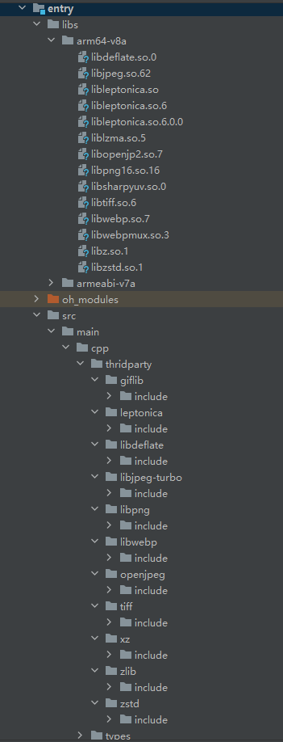

# leptonica集成到应用hap
本库是在RK3568开发板上基于OpenHarmony3.2 Release版本的镜像验证的，如果是从未使用过RK3568，可以先查看[润和RK3568开发板标准系统快速上手](https://gitee.com/openharmony-sig/knowledge_demo_temp/tree/master/docs/rk3568_helloworld)。
## 开发环境
- ubuntu20.04
- [OpenHarmony3.2.1Release镜像](https://gitee.com/link?target=https%3A%2F%2Frepo.huaweicloud.com%2Fopenharmony%2Fos%2F3.2.1%2Fdayu200_standard_arm32.tar.gz)
- [ohos_sdk_public 3.2.12.5](https://gitee.com/link?target=https%3A%2F%2Frepo.huaweicloud.com%2Fopenharmony%2Fos%2F3.2.1%2Fohos-sdk-windows_linux-public.tar.gz)
- [DevEco Studio 3.1 release](https://contentcenter-vali-drcn.dbankcdn.cn/pvt_2/DeveloperAlliance_package_901_9/16/v3/YO_7mAQNTbS8jekrvez5IA/devecostudio-windows-3.1.0.500.zip?HW-CC-KV=V1&HW-CC-Date=20230512T073650Z&HW-CC-Expire=315360000&HW-CC-Sign=90814E421B9A6D8DB4757FAFC21A965CF890A387DF9A2633B4AB797AD77E6485)    
- [准备三方库构建环境](../../../tools/README.md#编译环境准备)
- [准备三方库测试环境](../../../tools/README.md#ci环境准备)

## 编译三方库
- 下载本仓库
  ```
  git clone https://gitee.com/openharmony-sig/tpc_c_cplusplus.git --depth=1
  ```
- 三方库目录结构
  ```
  tpc_c_cplusplus/thirdparty/leptonica     #三方库leptonica的目录结构如下
  ├── adapted                              #存放三方库适配需要的代码文件
  ├── BUILD.gn                             # 构建脚本，支持rom包集成
  ├── docs                                 #三方库相关文档的文件夹
  ├── bundle.json                          #三方库组件定义文件
  ├── HPKBUILD                             #构建脚本
  ├── SHA512SUM                            #三方库校验文件
  ├── README.OpenSource                    #说明三方库源码的下载地址，版本，license等信息
  ├── README_zh.md      
  ```
  
- 将leptonica拷贝和依赖的库拷贝至tools/main目录下
  ```
  cd tpc_c_cplusplus
  cp thirdparty/leptonica tools/main -rf
  cp thirdparty/zlib tools/main -rf
  cp thirdparty/libpng tools/main -rf
  cp thirdparty/libjpeg-turbo tools/main -rf
  cp thirdparty/libwebp tools/main -rf
  cp thirdparty/tiff tools/main -rf
  cp thirdparty/giflib tools/main -rf
  cp thirdparty/openjpeg tools/main -rf
  cp thirdparty/xz tools/main -rf
  cp thirdparty/zstd tools/main -rf
  cp thirdparty/libdeflate tools/main -rf
  ```
- 在tools目录下编译三方库
  编译环境的搭建参考[准备三方库构建环境](../../../tools/README.md#编译环境准备)
  
  ```
  cd tools
  ./build.sh leptonica zlib libpng libjpeg-turbo libwebp tiff giflib openjpeg zstd xz libdeflate
  ```
- 三方库头文件及生成的库
  在tools目录下会生成usr目录，该目录下存在已编译完成的32位和64位三方库
  
  ```
  leptonica/arm64-v8a    leptonica/armeabi-v7a             zlib/arm64-v8a          zlib/armeabi-v7a   
  libpngc/arm64-v8a      libpng/armeabi-v7a                libjpeg-turbo/arm64-v8a libjpeg-turbo/armeabi-v7a 
  libwebp/arm64-v8a      libwebp/armeabi-v7a               tiff/arm64-v8a          tiff/armeabi-v7a 
  giflib/arm64-v8a       giflib/armeabi-v7a                openjpeg/arm64-v8a      openjpeg/armeabi-v7a 
  zstd/arm64-v8a         zstd/armeabi-v7a                  xz/arm64-v8a            xz/armeabi-v7a 
  libdeflate/arm64-v8a   libdeflate/armeabi-v7a       
  ```
  
- [测试三方库](#测试三方库)

## 应用中使用三方库
- 拷贝动态库到`\\entry\libs\${OHOS_ARCH}\`目录：
  动态库需要在`\\entry\libs\${OHOS_ARCH}\`目录，才能集成到hap包中，所以需要将对应的so文件拷贝到对应CPU架构的目录
- 在IDE的cpp目录下新增thirdparty目录，将编译生成的库拷贝到该目录下，如下图所示
&nbsp;
- 在最外层（cpp目录下）CMakeLists.txt中添加如下语句
  ```
  
  #将三方库加入工程中
  target_link_libraries(entry PRIVATE ${CMAKE_CURRENT_SOURCE_DIR}/../../../libs/${OHOS_ARCH}/libdeflate.so.0)
  target_link_libraries(entry PRIVATE ${CMAKE_CURRENT_SOURCE_DIR}/../../../libs/${OHOS_ARCH}/libleptonica.so.6.0.0)
  target_link_libraries(entry PRIVATE ${CMAKE_CURRENT_SOURCE_DIR}/../../../libs/${OHOS_ARCH}/libsharpyuv.so.0)
  target_link_libraries(entry PRIVATE ${CMAKE_CURRENT_SOURCE_DIR}/../../../libs/${OHOS_ARCH}/libz.so.1)
  target_link_libraries(entry PRIVATE ${CMAKE_CURRENT_SOURCE_DIR}/../../../libs/${OHOS_ARCH}/libjpeg.so.62)
  target_link_libraries(entry PRIVATE ${CMAKE_CURRENT_SOURCE_DIR}/../../../libs/${OHOS_ARCH}/liblzma.so.5)
  target_link_libraries(entry PRIVATE ${CMAKE_CURRENT_SOURCE_DIR}/../../../libs/${OHOS_ARCH}/libtiff.so.6)
  target_link_libraries(entry PRIVATE ${CMAKE_CURRENT_SOURCE_DIR}/../../../libs/${OHOS_ARCH}/libzstd.so.1)
  target_link_libraries(entry PRIVATE ${CMAKE_CURRENT_SOURCE_DIR}/../../../libs/${OHOS_ARCH}/libleptonica.so)
  target_link_libraries(entry PRIVATE ${CMAKE_CURRENT_SOURCE_DIR}/../../../libs/${OHOS_ARCH}/libopenjp2.so.7)
  target_link_libraries(entry PRIVATE ${CMAKE_CURRENT_SOURCE_DIR}/../../../libs/${OHOS_ARCH}/libwebp.so.7)
  target_link_libraries(entry PRIVATE ${CMAKE_CURRENT_SOURCE_DIR}/../../../libs/${OHOS_ARCH}/libleptonica.so.6)
  target_link_libraries(entry PRIVATE ${CMAKE_CURRENT_SOURCE_DIR}/../../../libs/${OHOS_ARCH}/libpng16.so.16)
  target_link_libraries(entry PRIVATE ${CMAKE_CURRENT_SOURCE_DIR}/../../../libs/${OHOS_ARCH}/libwebpmux.so.3)
  #将三方库的头文件加入工程中
  target_include_directories(entry PRIVATE ${CMAKE_CURRENT_SOURCE_DIR}/thirdparty/leptonica/${OHOS_ARCH}/include)
  target_include_directories(entry PRIVATE ${CMAKE_CURRENT_SOURCE_DIR}/thirdparty/zlib/${OHOS_ARCH}/include)
  target_include_directories(entry PRIVATE ${CMAKE_CURRENT_SOURCE_DIR}/thirdparty/libpng/${OHOS_ARCH}/include)
  target_include_directories(entry PRIVATE ${CMAKE_CURRENT_SOURCE_DIR}/thirdparty/libjpeg-turbo/${OHOS_ARCH}/include)
  target_include_directories(entry PRIVATE ${CMAKE_CURRENT_SOURCE_DIR}/thirdparty/libwebp/${OHOS_ARCH}/include)
  target_include_directories(entry PRIVATE ${CMAKE_CURRENT_SOURCE_DIR}/thirdparty/giflib/${OHOS_ARCH}/include)
  target_include_directories(entry PRIVATE ${CMAKE_CURRENT_SOURCE_DIR}/thirdparty/openjpeg/${OHOS_ARCH}/include)
  target_include_directories(entry PRIVATE ${CMAKE_CURRENT_SOURCE_DIR}/thirdparty/tiff/${OHOS_ARCH}/include)
  target_include_directories(entry PRIVATE ${CMAKE_CURRENT_SOURCE_DIR}/thirdparty/zstd/${OHOS_ARCH}/include)
  target_include_directories(entry PRIVATE ${CMAKE_CURRENT_SOURCE_DIR}/thirdparty/xz/${OHOS_ARCH}/include)
  target_include_directories(entry PRIVATE ${CMAKE_CURRENT_SOURCE_DIR}/thirdparty/libdeflate/${OHOS_ARCH}/include)
  
  ```
  
## 测试三方库
三方库的测试使用原库自带的测试用例来做测试，[准备三方库测试环境](../../../tools/README.md#ci环境准备)

进入到构建目录执行 make -C prog check-TESTS 运行测试用例，如下截图（arm64-v8a-build为构建64位的目录，armeabi-v7a-build为构建32位的目录）


## 参考资料
- [润和RK3568开发板标准系统快速上手](https://gitee.com/openharmony-sig/knowledge_demo_temp/tree/master/docs/rk3568_helloworld)
- [OpenHarmony三方库地址](https://gitee.com/openharmony-tpc)
- [OpenHarmony知识体系](https://gitee.com/openharmony-sig/knowledge)
- [通过DevEco Studio开发一个NAPI工程](https://gitee.com/openharmony-sig/knowledge_demo_temp/blob/master/docs/napi_study/docs/hello_napi.md)
