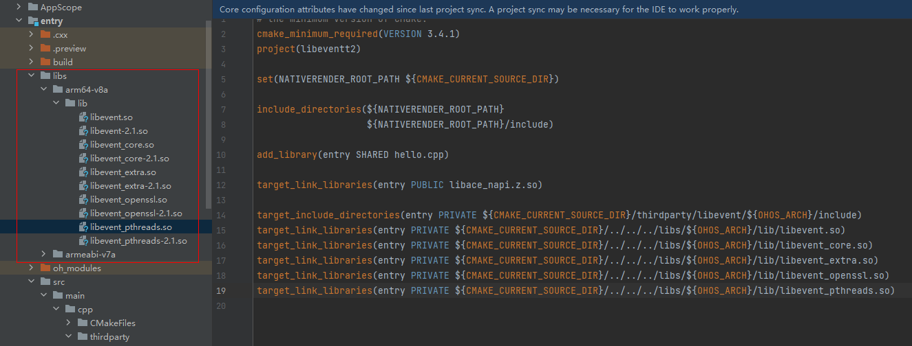
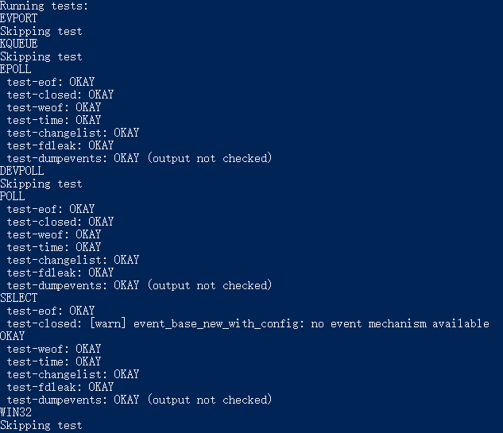

# libevent集成到应用hap

本库是在HUAWEI Mate 60上基于OpenHarmony4.1 Release版本的镜像验证的。

## 开发环境

- [开发环境准备](../../../docs/hap_integrate_environment.md)

## 编译三方库

- 下载本仓库

  ```shell
  git clone https://gitee.com/openharmony-sig/tpc_c_cplusplus.git --depth=1
  ```

- 三方库目录结构

  ```shell
  tpc_c_cplusplus/thirdparty/libevent     #三方库libevent的目录结构如下
  ├── docs                             	#三方库相关文档的文件夹
  ├── HPKBUILD                         	#构建脚本
  ├── HPKCHECK                         	#测试脚本
  ├── SHA512SUM                        	#三方库校验文件
  ├── README.OpenSource                	#说明三方库源码的下载地址，版本、license等信息
  ├── README_zh.md   
  ```
  
- 在lycium目录下编译三方库

  编译环境的搭建参考[准备三方库构建环境](../../../lycium/README.md#1编译环境准备)

  ```shell
  cd lycium
  ./build.sh libevent
  ```

- 三方库头文件及生成的库

  在lycium目录下会生成usr目录，该目录下存在已编译完成的32位和64位三方库

  ```shell
  libevent/arm64-v8a   libevent/armeabi-v7a
  ```
  
- [测试三方库](#测试三方库)

## 应用中使用三方库

- 需要将libevent生成的.so结尾的动态库文件下图所示拷贝到entry/libs目录下
- 

- 在IDE的cpp目录下新增thirdparty目录，将编译生成的库拷贝到该目录下，如下图所示
  
  
  
- 在最外层（cpp目录下）CMakeLists.txt中添加如下语句

  ```cmake
  #将三方库的头文件加入工程中
  target_include_directories(entry PRIVATE ${CMAKE_CURRENT_SOURCE_DIR}/thirdparty/libevent/${OHOS_ARCH}/include)
  target_link_libraries(entry PRIVATE ${CMAKE_CURRENT_SOURCE_DIR}/../../../libs/${OHOS_ARCH}/lib/libevent.so)
  ```
  

## 测试三方库

三方库的测试使用原库自带的测试用例来做测试，[准备三方库测试环境](../../../lycium/README.md#3ci环境准备)


进入库文件到解压文件夹内的test目录，根据测试平台使用gcc或clang命令生产相应的二进制文件，执行如下命令 ./tests.sh 

&nbsp;

&nbsp;

## 参考资料

- [OpenHarmony三方库地址](https://gitee.com/openharmony-tpc)
- [OpenHarmony知识体系](https://gitee.com/openharmony-sig/knowledge)
- [通过DevEco Studio开发一个NAPI工程](https://gitee.com/openharmony-sig/knowledge_demo_temp/blob/master/docs/napi_study/docs/hello_napi.md)