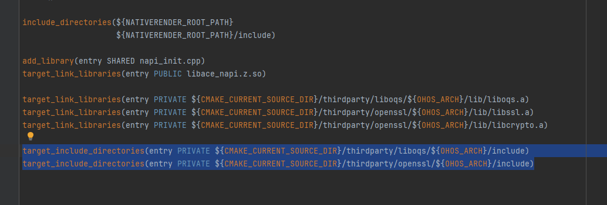
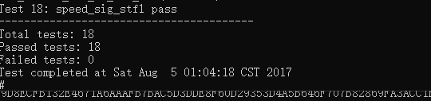

# liboqs集成到应用hap
本库是在RK3568开发板上基于OpenHarmony3.2 Release版本的镜像验证的，如果是从未使用过RK3568，可以先查看[润和RK3568开发板标准系统快速上手](https://gitee.com/openharmony-sig/knowledge_demo_temp/tree/master/docs/rk3568_helloworld)。
## 开发环境

- [开发环境准备](../../../docs/hap_integrate_environment.md)

## 编译三方库
- 下载本仓库
  ```
  git clone https://gitee.com/openharmony-sig/tpc_c_cplusplus.git --depth=1
  ```

- 三方库目录结构
  ```
    tpc_c_cplusplus/thirdparty/liboqs		#三方库liboqs的目录结构如下
    ├── liboqs                            #三方库liboqs的目录
    │   ├── HPKBUILD						    #构建脚本
    │   ├── HPKCHECK						    #测试脚本
    │   ├── README.OpenSource				    #说明三方库源码的下载地址，版本，license等信息
    │   ├── README_zh.md					    #liboqs三方库说明
    │   └── docs                              #三方库相关文档的文件夹
    │       ├── pic
    │       │   ├── liboqs_install_dir.png
    │       │   ├── liboqs_test.png
    │       │   └── liboqs_usage.png
    │       └── hap_integrate.md
  ```
  
- 在lycium目录下编译三方库
  编译环境的搭建参考[准备三方库构建环境](../../../lycium/README.md#1编译环境准备)
  
  ```
  cd lycium
  ./build.sh liboqs
  ```

- 三方库头文件及生成的库
  在lycium目录下会生成usr目录，该目录下存在已编译完成的32位和64位三方库
  ```
  liboqs/arm64-v8a   liboqs/armeabi-v7a
  ```

- [测试三方库](#测试三方库)

## 应用中使用三方库

- 在IDE的cpp目录下新增thirdparty目录，将编译生成的库以及依赖库拷贝到该目录下，如下图所示
  
&nbsp;

- 在最外层（cpp目录下）CMakeLists.txt中添加如下语句
  ```
  #将三方库加入工程中
  target_link_libraries(entry PRIVATE ${CMAKE_CURRENT_SOURCE_DIR}/thirdparty/liboqs/${OHOS_ARCH}/lib/liboqs.a)
  target_link_libraries(entry PRIVATE ${CMAKE_CURRENT_SOURCE_DIR}/thirdparty/openssl/${OHOS_ARCH}/lib/libssl.a)
  target_link_libraries(entry PRIVATE ${CMAKE_CURRENT_SOURCE_DIR}/thirdparty/openssl/${OHOS_ARCH}/lib/libcrypto.a)

  #将三方库的头文件加入工程中
  target_include_directories(entry PRIVATE ${CMAKE_CURRENT_SOURCE_DIR}/thirdparty/liboqs/${OHOS_ARCH}/include)
  target_include_directories(entry PRIVATE ${CMAKE_CURRENT_SOURCE_DIR}/thirdparty/openssl/${OHOS_ARCH}/include)
  ```

&nbsp;

## 测试三方库
三方库的测试使用原库自带的测试用例来做测试，[准备三方库测试环境](../../../lycium/README.md#3ci环境准备)

- 将编译生成的可执行文件及生成的动态库准备好

- 1.将本地测试库，资源文件推送至测试机
	hdc file send tpc_c_cplusplus.tar.gz /data
  2.将编译出的静态库文件推送至测试机
	hdc file send liboqs.a /system/lib
	hdc file send libssl.a /system/lib
	hdc file send libcrypto.a /system/lib
  3.进入测试机进行解压
	hdc shell
	cd data
	tar -xvf tpc_c_cplusplus.tar.gz
  4.执行测试
	cd tpc_c_cplusplus/lycium
	./test.sh liboqs

&nbsp;

## 参考资料
- [润和RK3568开发板标准系统快速上手](https://gitee.com/openharmony-sig/knowledge_demo_temp/tree/master/docs/rk3568_helloworld)
- [OpenHarmony三方库地址](https://gitee.com/openharmony-tpc)
- [OpenHarmony知识体系](https://gitee.com/openharmony-sig/knowledge)
- [通过DevEco Studio开发一个NAPI工程](https://gitee.com/openharmony-sig/knowledge_demo_temp/blob/master/docs/napi_study/docs/hello_napi.md)
