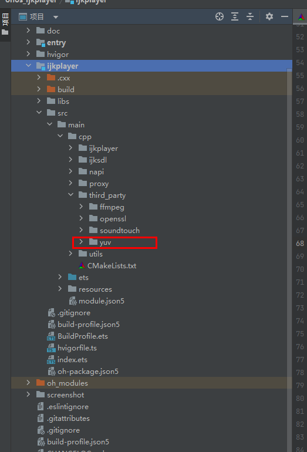

# libyuv-ijk三方库说明

## 前言

​	libyuv-ijk是为适配[ohos_ijkplayer](https://gitee.com/openharmony-sig/ohos_ijkplayer)的指定版本，Branches：ijk-r0.2.1-dev。


## 构建准备

[准备三方库构建环境](../../lycium/README.md#1编译环境准备)


## 构建方式

```
#编译库
cd tpc_c_cplusplus/lycium
./build.sh libyuv-ijk

#库所在目录
tpc_c_cplusplus/lycium/usr/yuv
```


## 如何在[ohos_ijkplayer](https://gitee.com/openharmony-sig/ohos_ijkplayer) 中使用

1.在库目录中取出openssl以及FFmpeg的文件夹，存放到工程的ijkplayer/src/main/cpp/thirdparty下，如图所示



2.修改ijkplayer/src/main/cpp/下的CMakeLists.txt文件以及ijkplayer、ijksdl中的CMakeLists.txt文件，总共三个CMakeLists.txt文件，请注意

```
#ijkplayer/src/main/cpp/ijkplayer中的CMakeLists.txt添加如下内容
include_directories(${CMAKE_CURRENT_SOURCE_DIR}/../third_party/yuv/include)
```

```
#ijkplayer/src/main/cpp/ijksdl中的CMakeLists.txt添加如下内容
include_directories(${CMAKE_CURRENT_SOURCE_DIR}/../third_party/yuv/include)

target_link_libraries(ijksdl yuv)

add_library(yuv STATIC IMPORTED)
set_target_properties(yuv PROPERTIES IMPORTED_LOCATION
    ${CMAKE_CURRENT_SOURCE_DIR}/../third_party/yuv/${OHOS_ARCH}/libyuv.a)
```

```
#ijkplayer/src/main/cpp/中的CMakeLists.txt添加如下内容
include_directories(${CMAKE_CURRENT_SOURCE_DIR}/third_party/yuv/include)

修改
set(CMAKE_C_FLAGS "${CMAKE_C_FLAGS} -Wno-int-conversion")
替换成
set(CMAKE_C_FLAGS "${CMAKE_C_FLAGS} -Wno-int-conversion -Wl,-Bsymbolic")
set(CMAKE_CXX_FLAGS "${CMAKE_CXX_FLAGS} -Wno-int-conversion -Wl,-Bsymbolic")
```

